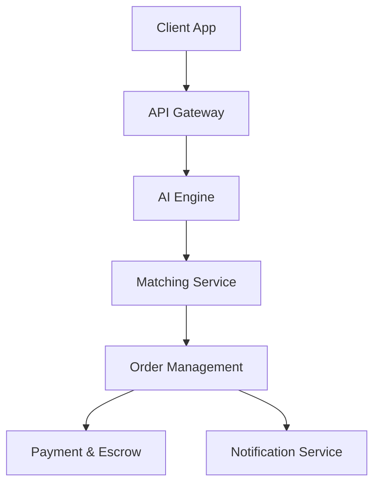

# Architecture

The HalQil platform operates as a modern monorepo driven by `pnpm` workspaces and `Turborepo`.

## High-Level Diagram

## Structure
- `apps/web`: Next.js Web App
- `apps/api`: Express.js + Prisma API
- `apps/admin`: Admin Dashboard
- `apps/mobile`: Mobile app placeholder
